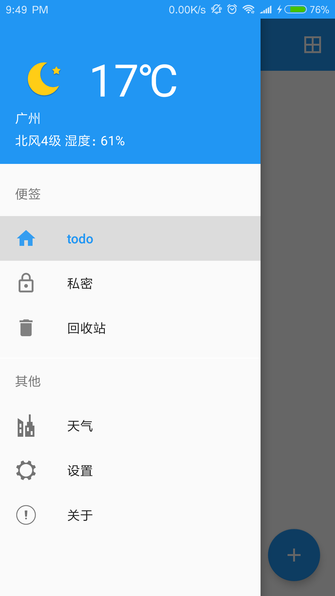
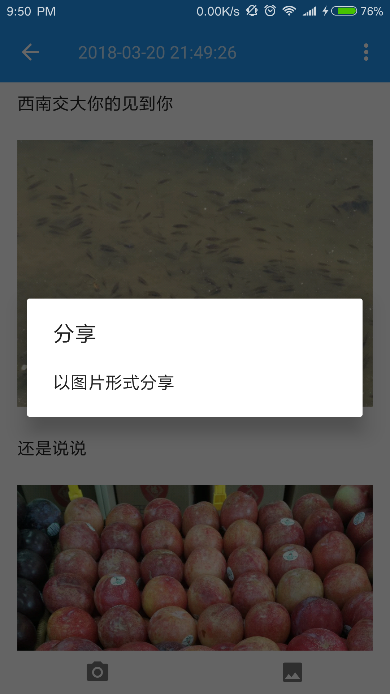

# Todolist
发呆便签是一款极简的便签软件，却又绚丽多彩。

## 功能简介
* 【便签夹分类】 让你的生活井然有序
* 【图文编辑】  不只是单调的文字
* 【私密便签】 方便且安全
* 【废纸篓功能】 世上是有后悔药的
* 【涂鸦功能】 我是画画的小行家
* 【天气预报】 今天你带伞了吗


### 项目截图
### 项目截图
<a href="../art/todo1.png"></a><a href="../art/todo2.png"></a>
<a href="../art/todo3.png"></a><a href="../art/todo4.png"></a>


App体验：[Todolist - fir.im ](https://fir.im/tolist)


### 项目中用到的知识
* 命名规范：
  * 主要参考Blankj：[Android 开发规范（完结版） - 简书](https://www.jianshu.com/p/45c1675bec69)
  * [《阿里巴巴Java开发手册》](https://yq.aliyun.com/articles/69327)
    以及解读版：[阿里巴巴java开发手册解读1-命名规约|香辣猪蹄儿](http://yvshuo.me/blog/docs/alibaba/index.html)
  * [《阿里巴巴Android开发手册》](https://yq.aliyun.com/articles/499254)
* Java基础:
  * Date跟Calendar:[Date类学习总结(Calendar Date 字符串 相互转换 格式化)](http://blog.csdn.net/footballclub/article/details/45191061)
    以及 [关于时间，日期，星期，月份的算法（Java中Calendar的使用方法）](http://blog.csdn.net/haima573979352/article/details/14448797)
* Android基础:
  * Android基础知识复习:
     * [尚硅谷15天Android基础(复习笔记) - CSDN博客](http://blog.csdn.net/simplebam/article/details/70213167)
     * [《Android 第一行代码》](http://blog.csdn.net/guolin_blog/article/details/52032038)
     * 内部存储跟外部存储的区别,
        * [Android存储访问及目录 - 圣骑士wind - 博客园](http://www.cnblogs.com/mengdd/p/3742623.html)
        * [安卓内外部存储完全解析](https://www.jianshu.com/p/116025bf51f7)
        * [彻底搞懂Android文件存储---内部存储，外部存储以及各种存储路径解惑](http://blog.csdn.net/u010937230/article/details/73303034)
     * [Android之各分辨率定义的图片规格 ](http://www.nljb.net/default/Android%E4%B9%8B%E5%90%84%E5%88%86%E8%BE%A8%E7%8E%87%E5%AE%9A%E4%B9%89%E7%9A%84%E5%9B%BE%E7%89%87%E8%A7%84%E6%A0%BC/)
  * 四大组件:
     * Activity:
        * 启动模式:[Activity的四种启动模式-图文并茂 – Android开发中文站](http://www.androidchina.net/3173.html)
        * 状态保存与恢复:[Android Activity 和 Fragment 状态保存与恢复的最佳实践](https://www.jianshu.com/p/45cc7775a44b)
        * 动画切换:[酷炫的Activity切换动画，打造更好的用户体验 - 简书](https://www.jianshu.com/p/37e94f8b6f59)
        * 标签属性:[Android Activity标签属性 - 简书](https://www.jianshu.com/p/8598825222cc)
     * PreferenceActivity:
        * [Android开发之PreferenceActivity的使用 - 简书](https://www.jianshu.com/p/4a65f4a912c6)
        * [Preference 三种监听事件说明 - wangjicong_215的博客 - CSDN博客](http://blog.csdn.net/wangjicong_215/article/details/52209380)
     * Fragment
        * [实现Activity和Fragment之前通信 - CSDN博客](http://blog.csdn.net/xuxian361/article/details/75529810)
        * [死磕 Fragment 的生命周期 - MeloDev的博客 - CSDN博客](http://blog.csdn.net/MeloDev/article/details/53406019)
        * [android fragment onHiddenChanged的使用 - CSDN博客](http://blog.csdn.net/bzlj2912009596/article/details/62851537)
           ,这里是为了解释第二篇博文准备的
        * [Fragment的setUserVisibleHint方法实现懒加载，但
          setUserVisibleHint 不起作用？ - Leevey·L - 博客园](http://www.cnblogs.com/leevey/p/5678037.html)
          ,这里是为了解释第二篇博文准备的
        * [TabLayout使用详解 - 简书](https://www.jianshu.com/p/7f79b08f5afa)
          ,这里是为了解释第二篇博文准备的
        * [套在ViewPagerz中的Fragment在各种状态下的生命周期 - CSDN博客](http://blog.csdn.net/jemenchen/article/details/52645380)
        * [Android -- Fragment 基本用法、生命周期与细节注意 - 简书](https://www.jianshu.com/p/1ff18ec1fb6b)
        * [Fragment全解析系列（一）：那些年踩过的坑 - 简书](https://www.jianshu.com/p/d9143a92ad94)
          ,这系列的四篇都很经典,建议你可以看看
        * 还不知道怎么入门解析Fragment的可以看我的面经,里面涉及了(卖个广告),
          [Android面经-基础篇(持续更新...) - CSDN博客](http://blog.csdn.net/simplebam/article/details/77989675)
        * 关于保存和恢复Fragment目前最正确的状态:[The Real Best Practices to Save/Restore Activity's and Fragment's state. (StatedFragment is now deprecated)](https://inthecheesefactory.com/blog/fragment-state-saving-best-practices/en)
  * Material Design:
    * [Android Theme.AppCompat 中，你应该熟悉的颜色属性 - 简书 ](https://www.jianshu.com/p/15c6397685a0)
      这家伙的关于MD文章也是值得一看的,简短but精辟
    * Toolbar:
        * [Android ActionBar完全解析，使用官方推荐的最佳导航栏(上)](http://blog.csdn.net/guolin_blog/article/details/18234477)
        * [ToolBar使用心得(如何改变item的位置) - 泡在网上的日子](http://www.jcodecraeer.com/plus/view.php?aid=7667)
        * [Toolbar+DrawerLayout+NavigationView使用心得](http://www.jcodecraeer.com/a/anzhuokaifa/2017/0317/7694.html)
        * [Android ToolBar 使用完全解析 - 简书]( https://www.jianshu.com/p/ae0013a4f71a)
    * CoordinatorLayout(本身就是一个加强版的FrameLayout)可以监听其所有子控件
      的各种事件,然后自动帮助我们做出最为最为合理的响应 <--(寄生) AppBarLayout
      (垂直的LinearLayout加强版),它在内部做了很多滚动事件的封装
      <--(寄生) CollapsingToolBarLayout(可折叠式标题栏)
        * CoordinatorLayout:[CoordinatorLayout与滚动的处理-泡在网上的日子](http://www.jcodecraeer.com/a/anzhuokaifa/androidkaifa/2015/0717/3196.html)
        * DrawLayout:
          * [android官方侧滑菜单DrawerLayout详解 - 泡在网上的日子](http://www.jcodecraeer.com/a/anzhuokaifa/androidkaifa/2014/0925/1713.html)
          * [用Android自带的DrawerLayout和ActionBarDrawerToggle实现侧滑效
            果 - CSDN博客](http://blog.csdn.net/miyuexingchen/article/details/52232751)
          * [Drawer 详解 ·Material Design Part 3 - Android - 掘金](https://juejin.im/entry/5825c76d67f3560058d23657)
    * RecyclerView:
        * [RecyclerView简单使用总结 - 简书](https://www.jianshu.com/p/9b3949f7cb0f)
        * [RecyclerView使用完全指南，是时候体验新控件了（一） - 简书](https://www.jianshu.com/p/4fc6164e4709)
    * SwipeRefreshLayout:
        * [SwipeRefreshLayout详解和自定义上拉加载更多 - 简书 ](https://www.jianshu.com/p/d23b42b6360b)
        * [SwipeRefreshLayout+RecyclerView冲突的几种解决方案 - 简书](https://www.jianshu.com/p/34cbaddb668b)
    * NestedScrollView :[NestedScrollView的使用 - CSDN博客 ](http://blog.csdn.net/mchenys/article/details/51541306)
    * 看不懂物料设计的话建议买郭霖先生的《第二行代码》好一点，这本书内容对于初级
      开发者来说还是蛮不错的
  * 异步消息机制:[Android异步消息处理机制完全解析，带你从源码的角度彻底理解](http://blog.csdn.net/guolin_blog/article/details/9991569)
  * 通知:[Android 通知栏Notification的整合 全面学习 （一个DEMO让你完全了解它）](https://www.kancloud.cn/digest/protectyoureyes/122214)
    以及[如何检测应用通知权限？如何跳转通知权限设置页？ - 掘金 ](https://juejin.im/post/5a2508656fb9a0450407b638)
  * 拍照以及选择图库:[Android 7.0调用相机拍照，返回后显示拍照照片 - CSDN博客](http://blog.csdn.net/ww897532167/article/details/71525514)
    以及 [android打开系统图库终极适配 - CSDN博客](http://blog.csdn.net/nbalichaoq/article/details/51992151)
  * 矢量图:[SVG 的 PathData 在 Android 中的使用 - CSDN博客 ](http://blog.csdn.net/zwlove5280/article/details/73196543)
    以及 [Android：获取并制作矢量图动画 - Android - 掘金](https://juejin.im/entry/5948c1ea8d6d81cc72fd1bbe)
  * 文本合成图片:[在代码中合成图片然后分享 - Android开发过程中的一些个人总结](https://segmentfault.com/a/1190000004554721)
* Android进阶
  * Android换肤:
    * [Android 探究 LayoutInflater setFactory - CSDN博客](http://blog.csdn.net/lmj623565791/article/details/51503977)
    * [Android主题换肤 无缝切换 - 简书](https://www.jianshu.com/p/af7c0585dd5b)
    * [fengjundev/Android-Skin-Loader: 一个通过动态加载本地皮肤包进行换肤的皮肤框架](https://github.com/fengjundev/Android-Skin-Loader)
  * Android混淆:[Android混淆备忘录 - 简书 ](https://www.jianshu.com/p/a48b49e9e2a8)
   * Gradle:
     * [Android 开发之版本统一规范 | Blankj's Blog ](https://blankj.com/2016/09/21/android-keep-version-unity/)
   * LruCache (最近最少使用)
     * [LinkedHashMap 的实现原理 - Java 集合学习指南 - 极客学院Wiki](http://wiki.jikexueyuan.com/project/java-collection/linkedhashmap.html)
     * [LruCache详解以及实战 - CSDN博客 ](http://blog.csdn.net/simplebam/article/details/79574368)
   * Span 使用
     * [Android TextView中文字通过SpannableString来设置超链接、颜色、字体等属性](http://blog.csdn.net/snowdream86/article/details/6776629))
     * [用SpannableString和ImageSpan在textview中插入图片 - 泡在网上的日子](http://www.jcodecraeer.com/a/anzhuokaifa/androidkaifa/2013/0731/1497.html)
     * [Android中ImageSpan的使用 - CSDN博客 ](http://blog.csdn.net/isee361820238/article/details/52425700)
   * 内存泄漏:[Android内存优化（三）避免可控的内存泄漏 - CSDN博客](http://blog.csdn.net/itachi85/article/details/73522042)
   * 注解:
     * 注解就是元数据，即一种描述数据的数据，可以描述类、方法、参数、变量、构造器及包声明中的特殊修饰符。
     * 元注解(在 java.lang.annotation提供了四种元注解)：
       * @Documented –注解是否将包含在JavaDoc中 ：
       * @Target? –注解用于什么地方 ：[JDK5.0新特性Annotation之自定义注解和@Target注解和@Documented注解](http://blog.csdn.net/jadyer/article/details/6219208)
       * @Retention –什么时候使用该注解 ：[JDK5.0新特性Annotation之@Retention注解](http://blog.csdn.net/jadyer/article/details/6219252)
       * @Inherited – 是否允许子类继承该注解：[JDK5.0新特性Annotation之@Inherited注解](http://blog.csdn.net/jadyer/article/details/6219285)
     * [android注解入门 并来自己写一个框架 - CSDN博客 ](http://blog.csdn.net/qfanmingyiq/article/details/53394783)
     * [Android 注解指南 - Android - 掘金 ](https://juejin.im/entry/58fc7ca744d9040069e65197)


### 项目中的用到的开源框架
* bugtags-移动时代首选 Bug 管理系统:[Bugtags 使用说明 - CSDN博客](http://blog.csdn.net/ObjectivePLA/article/details/51037804)
* Blankj/AndroidUtilCode：[终于等到你--权限工具类 - 简书](https://www.jianshu.com/p/333b09b7e000)
   * 偶然在掘金看到也比较好的utils库:[linqssonny/Utils](https://github.com/linqssonny/Utils)
* ButterKnife：[[Android开发] ButterKnife8.5.1 使用方法教程总结 - CSDN博客](http://blog.csdn.net/niubitianping/article/details/54893571)
* LitePal:
   * [Android数据库高手秘籍(一)——SQLite命令 - 郭霖的专栏 - CSDN博客](http://blog.csdn.net/guolin_blog/article/details/38461239)
     以及 [LitePal 1.6.0版本来袭，数据加解密功能保障你的应用数据安全](http://mp.weixin.qq.com/s/TSp36cnKLxUmAHjT86UCrQ)
   * LitePal使用心得(这里指的是 1.6.1 版本):
     * 实体private 、public、 public final 类型,LitePal都会存储,无需生成
       getter/setter 方法(其实就是默认存储实体中所有的字段/属性,如果不想存储,
       则设置使用@Column()中的ignore 属性)
     * 字段/属性 在数据库中一律使用小写存储,所以我们在 crud 时候可以忽略字段大小
       写操作,不过在查询时候如果where(" name=? ", name),如果 name (这个字段为
       String) 为 null 就会报错 "org.litepal.exceptions.DataSupportException: the
       bind value at index 1 is null"
     * Litepal 的注解 @Column(),里面有 nullable,unique,defaultValue,ignore
       四种方法
       * unique: 比如taskId设置了unique,当存储(save()方法)时候,数据库如果已经
        有该taskId,那就不存储(save() 方法返回 false)
* Gson-解析Json数据:[你真的会用Gson吗?Gson使用指南（一） - 简书 ](https://www.jianshu.com/p/e740196225a4)
  ,这个作者写的Gson系列教程很好,值得拜读
* Rx系列
  * 实战:[rengwuxian/RxJavaSamples: RxJava 2 和 Retrofit 实战](https://github.com/rengwuxian/RxJavaSamples)
  * RxJava:
     * 目前最好的RxJava文章,没有之一:[给初学者的RxJava2.0教程(一) - 简书 ](https://www.jianshu.com/p/464fa025229e)
     * 其他RxJava文章推荐:[RxJava2 学习资料推荐](http://mp.weixin.qq.com/s/UAEgdC2EtqSpEqvog0aoZQ)
     * [RxJava的观察者模式(二) - 简书 ](https://www.jianshu.com/p/238e350f7f3f)
     * [RxJava之过滤操作符 - 行云间 - CSDN博客](http://blog.csdn.net/io_field/article/details/51378909)
     * [RxJava之转换操作符 - CSDN博客](http://blog.csdn.net/io_field/article/details/51406910)
     * [RxJava2.0你不知道的事 - 简书](https://www.jianshu.com/p/785d9dfb0a5b)
  * RxLifecycle:[解决RxJava内存泄漏（前篇）：RxLifecycle详解及原理分析 -
    CSDN博客](http://blog.csdn.net/mq2553299/article/details/78927617)
    * 其中 RxLifecycle 已经推荐使用 AutoDispose :[Android架构中添加
      AutoDispose解决RxJava内存泄漏 - CSDN博客](http://blog.csdn.net/mq2553299/article/details/79418068)
  * RxPermissions:[使用RxPermissions（基于RxJava2） - CSDN博客](http://blog.csdn.net/u013553529/article/details/68948971)
    * 关于Android权限知识详解:
      * Android自定义权限与使用
        * [Android自定义权限与使用 - CSDN博客 ](http://blog.csdn.net/u014088294/article/details/51924223)
      * Android 运行时权限功能 - 针对6.0 / Android M 以上系统而言
        * 作用:用户不需要在安装软件的时候一次性授权所有申请的权限，而是可以在软
          件的使用过程中再对某一项权限申请进行授权。比如说一款相讥应用在运行时申
          请了地理位置定位权限，就算我拒绝了这个权限，但我应该依然可以使用这个应
          用的其他功能，而不是像之前那样直接无法安装它。
        * 运行时权限的核心：说白了就是在程序运行过程中由用户授权我们去执行某些危
          险操作，程序是不可以擅自做主去执行这些危险操作的。注意:我们在进行运行
          时权限处理时使用的是权限名，但是一旦用户同意授权了，那么该权限所对应的
          权限组的其他权限也同时被授权。
        * 基础篇：[《Android 第一行代码》](http://www.ituring.com.cn/book/1841)
          里面第7章的开头，其对应的源码：[RuntimePermissionTest](https://github.com/guolindev/booksource/tree/master/chapter7/RuntimePermissionTest)
          或者 [Android 6.0权限管理及最佳实践 - 简书](https://www.jianshu.com/p/cdcbd3038902)
        * 全面篇：[Android 6.0 运行时权限处理完全解析 - CSDN博客 ](http://blog.csdn.net/lmj623565791/article/details/50709663)
        * 实战篇：[Android权限管理详解 - CSDN博客](http://blog.csdn.net/shangmingchao/article/details/70312824)
        * 补充篇：[关于Android 6.0 运行时权限 | Android Notes ](https://bxbxbai.github.io/2016/05/27/android-runtime-permission/)
                 以及 [targetSdkVersion 23以下6.0中调用checkSelfPermission的问题 - 海阔天空玩世不恭](https://my.oschina.net/u/990728/blog/549914)
* Retrofit
   * [你真的会用Retrofit2吗?Retrofit2完全教程 - 简书](https://www.jianshu.com/p/308f3c54abdd)
   * [Android Retrofit 2.0使用 | 吴小龙同學](http://wuxiaolong.me/2016/01/15/retrofit/)
   * [Android Retrofit 2.0 使用-补充篇 - 简书](https://www.jianshu.com/p/93153b34310e)
* Glide
  * [Android图片加载框架最全解析（一），Glide的基本用法 - 郭霖的专栏](http://blog.csdn.net/guolin_blog/article/details/53759439)
    郭霖写的东西都很赞,值得推荐阅读
  * [Google推荐的图片加载库Glide介绍 - 泡在网上的日子](http://www.jcodecraeer.com/a/anzhuokaifa/androidkaifa/2015/0327/2650.html)
  * [Glide 一个专注于平滑滚动的图片加载和缓存库 - 简书](https://www.jianshu.com/p/4a3177b57949)
  * [Glide V4 框架新特性（Migrating from v3 to v4） - HeXinGen的博客 - CSDN博客](http://blog.csdn.net/hexingen/article/details/72578066)
* BaseRecyclerViewAdapterHelper:[BRVAH官方使用指南（持续更新） - 简书](https://www.jianshu.com/p/b343fcff51b0)
* PhotoView : [android 开源photoView的使用 - 简书](https://www.jianshu.com/p/6e38712e310f)
* LockPattern : [zhuanghongji/LockPattern: Android 九宫格图案解锁源码解析](https://github.com/zhuanghongji/LockPattern)


### Android 开发Tips && 性能优化
* Android开发Tips ：
  * [Android开发一点小技巧和建议献上 - 掘金](https://juejin.im/post/5a66bea86fb9a01caf378d33)
  * [Android 开发注意事项 - 简书](https://www.jianshu.com/p/0b40c02b6119)
* Android 性能优化：
  * [Android内存优化（使用SparseArray和ArrayMap代替HashMap） - CSDN博客 ](http://blog.csdn.net/u010687392/article/details/47809295)
  * [Android 基础1：SparseArray 和 ArrayMap （HashMap替代） - 简书 ](https://www.jianshu.com/p/38b3e72d6fea)
  * [Android布局优化之ViewStub、include、merge使用与源码分析 - CSDN博客 ](http://blog.csdn.net/bboyfeiyu/article/details/45869393)
* Bitmap 使用：
  * [Android 之 Bitmap - 简书 ](https://www.jianshu.com/p/98c88f9ceafa)
  * [Android高效加载大图、多图解决方案，有效避免程序OOM - CSDN博客 ](http://blog.csdn.net/guolin_blog/article/details/9316683)
  * [Android DiskLruCache完全解析，硬盘缓存的最佳方案 - CSDN博客 ](http://blog.csdn.net/guolin_blog/article/details/28863651)
  * [Android照片墙应用实现，再多的图片也不怕崩溃 - CSDN博客](http://blog.csdn.net/guolin_blog/article/details/9526203)
* 摆脱AsyncTask：
  * [用RxJava.Observable取代AsyncTask和AsyncTaskLoader-RxJava Android](http://blog.csdn.net/zhaokaiqiang1992/article/details/44751003)
  * [详细解读AsyncTask的黑暗面以及一种替代方案 - 简书 ](https://www.jianshu.com/p/d83fd0e8a062)
  * 第二篇只是让你知道 AsyncTask 的弊端,最建议使用RxJava 来解决
* 使用 Channel 或者 okio 提升读写能力
  * Okio:[大概是最完全的Okio源码解析文章 - 简书](https://www.jianshu.com/p/f033a64539a1)
  * Channel:[通俗编程——白话 NIO 之 Channel - 后端 - 掘金 ](https://juejin.im/entry/57a4aac3a633bd00603e83e5)


### 开发中遇到的问题
* 下面这bug解决办法,传送门;[[译文]Android Studio 3.0 发行说明 - CSDN博客](http://blog.csdn.net/guiying712/article/details/78352062)
  ```
  Error:(42, 5) error: style attribute '@android:attr/windowEnterAnimation' not found.
  Error:(42, 5) error: style attribute '@android:attr/windowExitAnimation' not found.
  ```
  其实就是@android 前面的"@"去掉就好
* 在做三级联动省市区选择里面,一般都是采用第三方库居多一点,但存在或多或少的问题,
  比如数据太大导致很多时间等待甚至导致ANR、它提供的数据很多用不上(不可以更改数据)
  ,所以很难找到适合的这类开源库,哈哈哈,还是让我扎到了,看这里:[yanzhenjie/
  AddressChecker: MD风格的地址选择器](https://github.com/yanzhenjie/AddressChecker)
* 出现下面这个问题一般都是打包使用了注解而引发的问题:
 ```
 Warning:com.trello.rxlifecycle2.LifecycleProvider: can't find referenced class javax.annotation.Nonnull
 Warning:com.trello.rxlifecycle2.LifecycleProvider: can't find referenced class javax.annotation.CheckReturnValue
 ```
 rxlifecycle2作者已经给出了解决方案:[can't find referenced class javax.annotation.Nonnull · Issue #228 · trello/RxLifecycle ](https://github.com/trello/RxLifecycle/issues/228)
* 开发中经常发现软键盘一旦弹起来,界面会相对应向上弹,但很遗憾就是有时候不尽人意,
  只要往清单文件 AndroidManifest 里面对应的 Activity 配置
  ```
   android:windowSoftInputMode="adjustResize"
  ```
  参考博客:[EditText弹出输入键盘后页面往上顶的问题 - CSDN博客](http://blog.csdn.net/u012319317/article/details/51135813)
* RxJava中map()操作符里面的线城是在下游线程进行操作的,即observeOn()所订阅的线程
* 在开发中遇到了就是保存图片到本地,但是本地图库没有刷新,查看了网上才知道需要发送
  广播通知图库进行获取的:[Android保存图片到系统相册 - CSDN博客 ](http://blog.csdn.net/fengyenom1/article/details/78202955)
* 在开发过程中,在 sutsupportActionbar(toolbar) 之后,调用 toolbar.setTitle()
  设置标题无效,解决办法:[为什么 Android 中 Toolbar.setTitle() 没有效果](http://blog.csdn.net/zhyh1986/article/details/52220907)
* 打签名正式包出现以下这种情况:
  ```
  Error:Execution failed for task ':app:validateSigningRelease'.
  > Keystore file E:\acode\Android_Studio\Todolist\app\todolist.jks not found for signing config 'externalOverride'.
  ```
  其实就是你的 jks 密钥配置的路径不对,AS找不到,检查一下路径即可
  参考博客:[build - Android Error Building Signed APK - Stack Overflow](https://stackoverflow.com/questions/36173983/android-error-building-signed-apk)
* 之前一直以为Activity的Intent传值没有大小限制,但项目中传bitmap的byte[]数组,
  出现如下的异常(这里可能会报多个异常,但最核心就是下面这句话了)
  ```
    Caused by: android.os.TransactionTooLargeException: data parcel size 1808828 bytes
  ```

  * 关于Intent的大小问题,这篇是解析Intent传值限制的最好文章:[Activity之间使用
    intent传递大量数据带来问题总结 - CSDN博客 ](http://blog.csdn.net/Rflyee/article/details/47441405)
  * 关于常见异常,可以查看:[Binder异常解析 - Gityuan博客 | 袁辉辉博客 ](http://gityuan.com/2017/05/01/binder_exception/)
  * 解决办法:
    * 使用 EventBus 或者 RxBus 传送,参考博客:[Intent传递大量数据出现
      TransactionTooLargeException异常的解决方案](https://github.com/XConstantine/Android-tips-tricks/issues/4)
      * RxBus :
        * 这里需要一点RxJava的知识,看上面用到框架Rx系列那里,那里有教程
        * [用RxJava实现事件总线(Event Bus) - 简书 ](https://www.jianshu.com/p/ca090f6e2fe2)
        * [[深入RxBus]：异常处理 - 简书 ](https://www.jianshu.com/p/0493cc28a811)
        * [[深入RxBus]：支持Sticky事件 - 简书 ](https://www.jianshu.com/p/71ab00a2677b)
    * 把图片存到本地,然后传送图片路径或图片 uri过去
        * 本项目采用这种,好处就是:ShareActivity里面涉及了分享到第三方应用的功能
          ,该功能(分享时候使用的是图片的 Uri,即需要保存到图片保存到磁盘上),在
          跳转到 ShareActivity 之前的界面就已经生成图片了,那么可以提前保存啦
        * 因为本需求是当开始 ShareActivity 开启之前就生成图片了(即观察者在被观
          察者发送了普通消息(相对于粘性事件)之后才进行订阅,那么观察者就获不到之
          前的消息,由于目前的 Rxbus 不支持粘性事件,毕竟粘性事情涉及严重内存泄漏
          * 关于普通事情以及粘性事件的区别,看这里:[Android事件总线（一）
            EventBus3.0用法全解析 - CSDN博客 ](http://blog.csdn.net/itachi85/article/details/52205464)
* 这里在导入[zhuanghongji/LockPattern: Android 九宫格图案解锁源码解析，"程序锁"模拟场景使用](https://github.com/zhuanghongji/LockPattern)
   的时候,设置好图案密码之后会再进入会报mPoint为null从而导致崩溃,这里修正办法:
   将LockPatternView 类中的 isInitPoint 变量不要设置为静态即可
* 当我打开settingFragment时候,老是出现下面这个问题:
  ```
   Caused by: java.lang.ClassCastException: java.lang.Integer cannot be cast to java.lang.Boolean
   at com.yueyue.todolist.modules.setting.SettingFragment.onCreate(SettingFragment.java:81)
  ```
  其实这个问题我在伟大的[android - java.lang.Integer cannot be cast to java.lang.String on addPreferencesFromResource - Stack Overflow ](https://stackoverflow.com/questions/35833845/java-lang-integer-cannot-be-cast-to-java-lang-string-on-addpreferencesfromresour)
  里面找到了解决办法,我这里的问题是之前的缓存存储错误,存储到都是Boolean类型,但
  Fragment想拿Integer,那么就GG了,解决就是每次调试时候,手机先卸载旧版本


### 项目中的缺点
* 由于本人理解换肤方面的知识没有透彻,去掉换肤功能